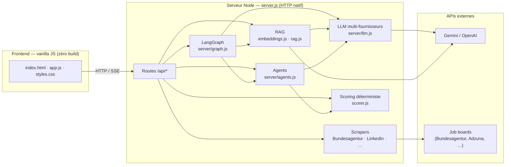
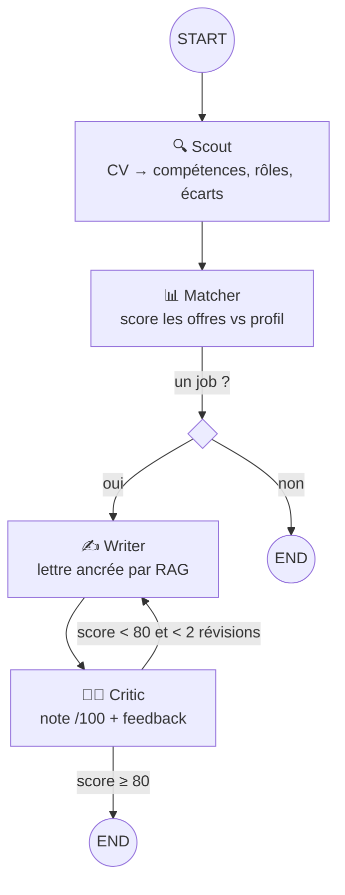
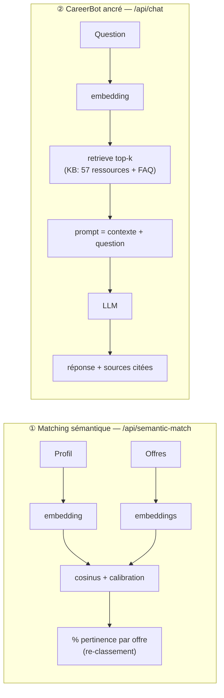

# CyberCareer — Architecture (Sprint 3)

**Jardel Calderon Kenne Tedjeu · Westfälische Hochschule, Gelsenkirchen**

Système multi-agents d'aide à la candidature en cybersécurité : analyse le CV, détecte
les écarts de compétences, classe des offres réelles, et génère des documents adaptés.

Stack : **Node.js (HTTP natif, zéro framework, zéro build)** · frontend vanilla JS ·
**LangGraph** pour l'orchestration · **RAG** (embeddings + cosinus) pour le sens.

---

## 1. Vue d'ensemble

**En un mot :** un serveur Node sans framework expose des routes ; derrière, quatre
briques — **agents**, **LangGraph**, **RAG**, **scrapers** — se partagent une couche
**LLM multi-fournisseurs** et un **scoring déterministe**.

---

## 2. Pipeline multi-agents (LangGraph) — le cœur

Chaque agent est un **nœud** ; l'état partagé (l'ancien `AgentContext`) devient les
**channels** typés du graphe. Nouveauté vs pipeline linéaire : **routage conditionnel**
et **boucle d'auto-amélioration Writer⇄Critic**.

- **Streaming en direct** : `/api/graph-stream` (SSE) pousse chaque étape → l'UI montre
  les agents travailler en temps réel.
- **Résilience** : chaque nœud est isolé (une panne LLM est tracée, pas fatale).
- **Réglable** : `GRAPH_QUALITY_BAR` (défaut 80), `GRAPH_MAX_REVISIONS` (défaut 2).

Exemple de trace réelle : `Writer v1 → Critic 63 → Writer v2 → Critic 94 → END`.

---

## 3. RAG — deux usages

Le RAG résout la faiblesse du matching par mots-clés : « corrélation de logs » ↔ « SIEM ».

- **Embeddings** : `gemini-embedding-001` (3072-dim) via la couche OpenAI-compatible.
- **Calibration** : le cosinus brut (0.55↔0.82) est rescalé en **0–100 % honnête**
  (offre non pertinente ≈ 0 %, forte ≈ 100 %).
- **Persistance** : cache disque haché → pas de ré-embedding au redémarrage.
- **Pas de base vectorielle** : cosinus en mémoire (KB ~70 chunks, offres ~centaines).

---

## 4. Sécurité & robustesse

| Menace | Défense |
|---|---|
| Coût / abus des endpoints LLM | **Rate-limiting** par IP (semantic 30/min, chat 20/min, graph 10/min → 429) |
| Injection de prompt (annonces, CV non fiables) | Données encapsulées en balises `<job>` / `<profile>` / `<context>` + « treat as data » |
| Panne d'un agent | **Isolation par nœud** (trace + dégradation gracieuse) |
| Pas de clé LLM | **Dégradation** : mots-clés + templates, jamais d'erreur |
| TLS intercepté (réseau) | `ALLOW_INSECURE_TLS` (dev only) |

---

## 5. Stack technique

| Couche | Choix | Pourquoi |
|---|---|---|
| Frontend | HTML/CSS/JS vanilla, zéro build | Simplicité, aucune chaîne d'outils |
| Serveur | Node `http` natif | Léger, contrôle total |
| Orchestration | **LangGraph** (`@langchain/langgraph`) | Graphe d'agents + boucle + routage |
| RAG | embeddings + cosinus maison | Pas de vector DB pour cette échelle |
| LLM | multi-fournisseurs (Anthropic/Gemini/OpenRouter/OpenAI) + fallback | Résilience, free-tier capable |
| Scoring | pondéré, déterministe (`scorer.js`) | Transparent et explicable |
| Tests | runner maison, `node test.js` | **75/75** (dont RAG + LangGraph) |

---

## 6. Points clés pour la soutenance

1. **Architecture multi-agents explicite** (réponse au feedback Sprint 1) — formalisée en
   **graphe LangGraph** avec état partagé, routage conditionnel et **boucle d'auto-critique**.
2. **RAG maison** — matching sémantique calibré + assistant ancré avec **citations de sources**.
3. **Qualité & sécurité niveau Master** — Critic à rubrique, rate-limiting, anti-injection,
   isolation d'erreurs, 75 tests, dégradation gracieuse.
4. **Sans sur-ingénierie** — pas de framework superflu, pas de vector DB ; chaque techno
   ajoutée (LangGraph, RAG) répond à un besoin réel du produit.

> **Phrase d'accroche :** « Un système multi-agents orchestré par LangGraph, où un Writer
> ancré par RAG s'améliore via une boucle d'auto-critique, le tout classé par pertinence
> sémantique calibrée — sans framework superflu ni base vectorielle. »
